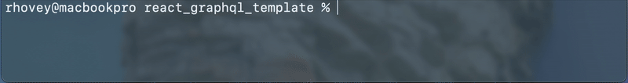

# What is this repository?

`react_graphql_template` is a template repository used to easily setup and run applications written in ReactJS (client-side) and GraphQL (server-side)

This repository uses a built in CLI (written in Rust) to easily handle all of the heavy lifting when it comes to setting up the project, installing dependencies, and running them together.

Although this CLI is still in development and is expected to have increased functionality, it is ready to use in its current state with minimal hassle. Please see [RGQL Docs](Docs/RGQL.md) for more information on the CLI itself.

# Starting a New Project

## Clone the Repository

Before anything you must first clone the repository

```bash
git clone https://github.com/hoveydev/react_graphql_template
```

>
> Warning! Please do not rename the root of the repository, the CLI relies on this to not be changed in order to function properly. A fix for this is currently in progress.
>

## Install the `rgql` CLI

There are two ways to reliably install this CLI.

### 1. Install from local directory

Since the CLI is included as part of this template you can simply install it from the repository with:

```bash
cargo install --path react_graphql_template/scripts
```

### 2. Install from the git repository (recommended)

Just as easily, you can install the CLI from GitHub directly with:

```bash
cargo install --git https://github.com/hoveydev/react_graphql_template
```

This is the recommended method if you want the latest version of the CLI after initially cloning the repository.

>
> New to Rust and Cargo? Follow [these steps](https://doc.rust-lang.org/cargo/getting-started/installation.html) to install cargo (it’s easier than you think 😉)
>

## Setup your Project

Using the `rgql` CLI, run the following command from the template root to automate the setup process:

```bash
rgql setup
```

>
> Note: You can optionally pass a `path` argument to specify the template root from anywhere in your system
>

After running this command, the script will search the repository for variables that have already been defined in the repository.

It will then prompt you to rename the variables to anything you want.



>
> Note: The CLI will not allow you to leave the names blank, you must name them something, even if you plan to rename them later.
>

Once your variables are named, the CLI will rename all the variables, files, and directories and then will install dependencies for both `client` and `server` applications, as well as run some other configuration steps (more information on this can be found in the {rgql docs})

Once the setup is complete, you can then open the project in your favorite editor and familiarize yourself with the [folder structure](Docs/FolderStructure.md).

## Run Your Application

After the setup process has completed, you are ready to run your application for the first time! Hooray!

Luckily, the `rgql` CLI also has this part covered with:

```bash
rgql start
```

Running this command will run both the `client` and `server` applications on their default ports: `3000` and `4000` respectively.

However, it is also easy to customize these ports with CLI arguments:

```bash
rgql start --client-port 3080 --server-port 4040
```

The above command will run the `client` application on port `3080` and the `server` application on port `4040`.

Congratulations! You have successfully setup your application and are now free to start development!

# Additional Information

## How are Variables Determined?

Throughout the repository there are a handful of variables that are parsed through when running the `rgql setup` command, but how exactly are these found? Well, without going into the full detail of how the CLI works, simply put, each variable has a prefix of `_CHANGE_ME_` which you may have noticed on the main directory: `_CHANGE_ME_PROJECT_SLUG`. This prefix was chosen because of it’s versatility with classnames, variable names, file names, and directory names. Anywhere you see this prefix is a variable that will be found by the CLI.

That being said, adding more variables with this prefix is possible. If you want to create your own template with this code, it’s as easy as adding/removing those variables.

## Hot Reloading

The `client` application is configured with `Vite` which supports hot reloading. This means that once the application is running, you are able to make changes and see them updated in real time after saving them. This also doesn’t effect state, so any state changes will remain until the client application is killed and reloaded.

More info on this topic and Vite in general can be found [here](https://vite.dev/guide/).

Unfortunately, the GraphQL `server` application does not work the same way. Any changes made to GraphQL will require a restart of the server before they apply.

If you are curious about GraphQL, you can find more information [here](https://www.apollographql.com/docs/react/get-started).

## Component Styling

When thinking through this project, I wanted to come up with the best way to scaffold components within the `client` structure. Originally, I was going to pick a component library and use that, but I wanted to give developers a bit more flexibility, so I instead opted to install two packages:

1. TailwindCSS
2. Motion

These packages are not only great for scaffolding and creating custom components within an application, but they are the two most common packages used for most component libraries. Installing both of these packages, I believe, gives the best of both situations without locking developers into one component style.

That being said, these packages aren’t necessary and can be easily uninstalled from the `client` application if they are not needed with:

```bash
npm uninstall tailwindcss @tailwindcss/vite motion
```

## Website Routing

This template comes pre-installed with `react-router-dom` for easy and intuitive routing in react. The router is included in it’s own `router.tsx` file within the `client` folder and defines a single route for the demo app screen. Of course, this can be expanded to include more routes and further documentation can be found here: https://reactrouter.com/home

>
> Note: Although version 7 is installed, I find that the `createBrowserRouter` implementation described in the version 6 documentation is more intuitive and easier to understand. You can read more about it [here](https://reactrouter.com/6.30.0/routers/create-browser-router)
>
